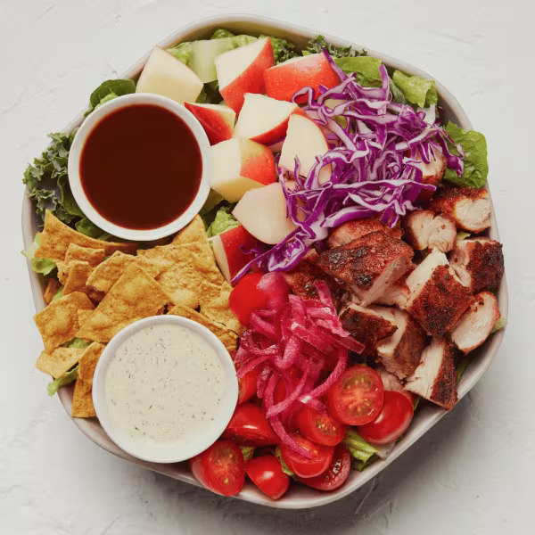

# BBQ Chicken Salad

### Official Summary:
- **Ingredients:** [Blackened Chicken](../Meats_Proteins/Blackened_Chicken.md), shredded cabbage, [Pickled Onions](../Fermented_Vegetables/Pickled_Onions.md), cherry tomatoes, apples, tortilla chips, chopped romaine, shredded kale, [Honey BBQ Sauce](../Sauces_Dressings/Honey_BBQ_Sauce.md), [Green Goddess Ranch](../Sauces_Dressings/Green_Goddess_Ranch.md)
- **Calories:** 520
- **Protein:** 22g
- **Carbs:** 38g
- **Fat:** 28g

### Estimated Ingredients and Macros:

| Ingredient                         | Amount                  | Calories | Protein | Carbs | Fat |
|------------------------------------|-------------------------|----------|---------|-------|-----|
| **[Blackened Chicken](../Meats_Proteins/Blackened_Chicken.md)**              | 6 oz (170g)             | ~300     | ~33g    | ~0g   | ~15g|
| **Shredded Cabbage**               | 1 cup (89g)             | ~22      | ~1g     | ~5g   | ~0g |
| **[Pickled Onions](../Fermented_Vegetables/Pickled_Onions.md)**                 | 1/4 cup (30g)           | ~10      | ~0g     | ~2g   | ~0g |
| **Cherry Tomatoes**                | 1 cup (150g)            | ~30      | ~1g     | ~6g   | ~0g |
| **Apples**                         | 1/2 medium (91g)        | ~48      | ~0g     | ~12g  | ~0g |
| **Tortilla Chips**                 | 1 oz (28g)              | ~140     | ~2g     | ~19g  | ~7g |
| **Chopped Romaine**                | 1 cup (47g)             | ~8       | ~1g     | ~2g   | ~0g |
| **Shredded Kale**                  | 1 cup (67g)             | ~34      | ~2g     | ~7g   | ~0g |
| **[Honey BBQ Sauce](../Sauces_Dressings/Honey_BBQ_Sauce.md)**                | 2 tablespoons (30ml)    | ~70      | ~1g     | ~6g   | ~4g |
| **[Green Goddess Ranch](../Sauces_Dressings/Green_Goddess_Ranch.md)**            | 2 tablespoons (30ml)    | ~120     | ~2g     | ~1g   | ~12g|

### Adjusted Total Macros:

- **Calories:** 782
- **Protein:** 43g
- **Carbs:** 60g
- **Fat:** 38g

[Back to Main Menu](../README.md)