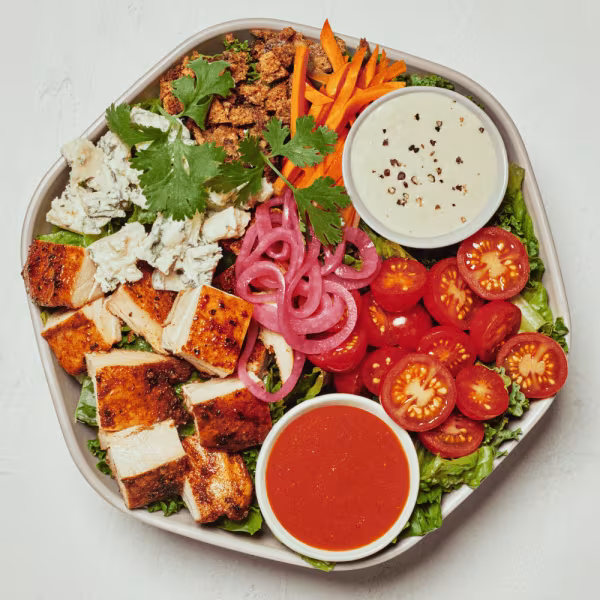

# Buffalo Chicken

### Official Summary:
- **Ingredients:** [Blackened Chicken](../Meats_Proteins/Blackened_Chicken.md), [Pickled Onions](../Fermented_Vegetables/Pickled_Onions.md), cherry tomatoes, raw carrots, cilantro, blue cheese, za’atar breadcrumbs, shredded kale, chopped romaine, sweetgreen hot sauce, caesar
- **Calories:** 555
- **Protein:** 31g
- **Carbs:** 32g
- **Fat:** 34g

### Estimated Ingredients and Macros:

| Ingredient                         | Amount                  | Calories | Protein | Carbs | Fat |
|------------------------------------|-------------------------|----------|---------|-------|-----|
| **[Blackened Chicken](../Meats_Proteins/Blackened_Chicken.md)**              | 6 oz (170g)             | ~300     | ~33g    | ~0g   | ~15g|
| **[Pickled Onions](../Fermented_Vegetables/Pickled_Onions.md)**                 | 1/4 cup (30g)           | ~10      | ~0g     | ~2g   | ~0g |
| **Cherry Tomatoes**                | 1 cup (150g)            | ~30      | ~1g     | ~6g   | ~0g |
| **Raw Carrots**                    | 1 cup (128g)            | ~52      | ~1g     | ~12g  | ~0g |
| **Cilantro**                       | 1/4 cup (4g)            | ~1       | ~0g     | ~0g   | ~0g |
| **Blue Cheese**                    | 1/4 cup (28g)           | ~100     | ~6g     | ~1g   | ~8g |
| **Za’atar Breadcrumbs**            | 1/4 cup (30g)           | ~110     | ~3g     | ~15g  | ~2g |
| **Shredded Kale**                  | 1 cup (67g)             | ~34      | ~2g     | ~7g   | ~0g |
| **Chopped Romaine**                | 1 cup (47g)             | ~8       | ~1g     | ~2g   | ~0g |
| **Sweetgreen Hot Sauce**           | 1 tablespoon (15ml)     | ~30      | ~0g     | ~1g   | ~3g |
| **[Caesar Dressing](../Sauces_Dressings/Caesar_Dressing.md)**                | 2 tablespoons (30ml)    | ~150     | ~2g     | ~2g   | ~16g |

### Adjusted Total Macros:

- **Calories:** 825
- **Protein:** 49g
- **Carbs:** 63g
- **Fat:** 44g

[Back to Main Menu](../README.md)