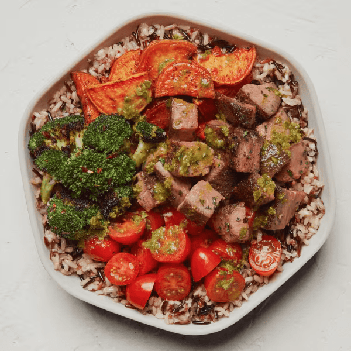

# Caramelized Garlic Steak

### Official Summary:
- **Ingredients:** [Caramelized Garlic Steak](../Meats_Proteins/Caramelized_Garlic_Steak.md), [Spicy Broccoli](../Cooked_Vegetables/Spicy_Broccoli.md), cherry tomatoes, [Warm Roasted Sweet Potatoes](../Cooked_Vegetables/Warm_Roasted_Sweet_Potatoes.md), [Wild Rice](../Grains_Carbs/Wild_Rice.md), [Pesto Vinaigrette](../Sauces_Dressings/Pesto_Vinaigrette.md)
- **Calories:** 860
- **Protein:** 31g
- **Carbs:** 89g
- **Fat:** 40g

### Estimated Ingredients and Macros:

| Ingredient                         | Amount                  | Calories | Protein | Carbs | Fat |
|------------------------------------|-------------------------|----------|---------|-------|-----|
| **[Caramelized Garlic Steak](../Meats_Proteins/Caramelized_Garlic_Steak.md)**       | 6 oz (170g)             | ~300     | ~25g    | ~0g   | ~15g|
| **[Spicy Broccoli](../Cooked_Vegetables/Spicy_Broccoli.md)**                 | 1 cup (150g)            | ~50      | ~3g     | ~10g  | ~1g |
| **Cherry Tomatoes**                | 1 cup (150g)            | ~30      | ~1g     | ~6g   | ~0g |
| **[Warm Roasted Sweet Potatoes](../Cooked_Vegetables/Warm_Roasted_Sweet_Potatoes.md)**    | 1 cup (133g)            | ~112     | ~2g     | ~27g  | ~0g |
| **[Wild Rice](../Grains_Carbs/Wild_Rice.md)**                      | 1 cup cooked (185g)     | ~160     | ~6g     | ~32g  | ~0.5g|
| **[Pesto Vinaigrette](../Sauces_Dressings/Pesto_Vinaigrette.md)**              | 2 tablespoons (30ml)    | ~150     | ~1g     | ~2g   | ~15g|

### Adjusted Total Macros:

- **Calories:** 802
- **Protein:** 38g
- **Carbs:** 77g
- **Fat:** 31.5g

[Back to Main Menu](../README.md)