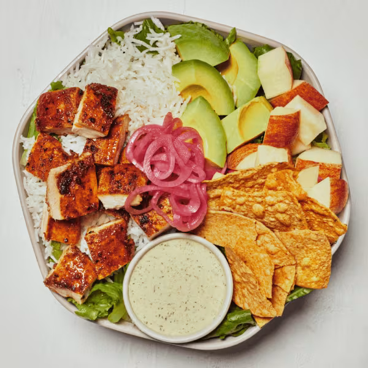

# Chicken Avocado Ranch

### Official Summary:
- **Ingredients:** [Blackened Chicken](../Meats_Proteins/Blackened_Chicken.md), avocado, [Pickled Onions](../Fermented_Vegetables/Pickled_Onions.md), apples, tortilla chips, [White Rice](../Grains_Carbs/White_Rice.md), chopped romaine, [Green Goddess Ranch](../Sauces_Dressings/Green_Goddess_Ranch.md)
- **Calories:** 705
- **Protein:** 23g
- **Carbs:** 59g
- **Fat:** 41g

### Estimated Ingredients and Macros:

| Ingredient                         | Amount                  | Calories | Protein | Carbs | Fat |
|------------------------------------|-------------------------|----------|---------|-------|-----|
| **[Blackened Chicken](../Meats_Proteins/Blackened_Chicken.md)**              | 6 oz (170g)             | ~300     | ~33g    | ~0g   | ~15g|
| **Avocado**                        | 1/2 medium (100g)       | ~160     | ~2g     | ~9g   | ~15g|
| **[Pickled Onions](../Fermented_Vegetables/Pickled_Onions.md)**                 | 1/4 cup (30g)           | ~10      | ~0g     | ~2g   | ~0g |
| **Apples**                         | 1 medium (182g)         | ~95      | ~0g     | ~25g  | ~0g |
| **Tortilla Chips**                 | 1 oz (28g)              | ~140     | ~2g     | ~19g  | ~7g |
| **[White Rice](../Grains_Carbs/White_Rice.md)**                     | 1/2 cup cooked (92g)    | ~100     | ~2g     | ~22g  | ~0g |
| **Chopped Romaine**                | 1 cup (47g)             | ~8       | ~1g     | ~2g   | ~0g |
| **[Green Goddess Ranch](../Sauces_Dressings/Green_Goddess_Ranch.md)**            | 2 tablespoons (30ml)    | ~120     | ~2g     | ~1g   | ~12g|

### Adjusted Total Macros:

- **Calories:** 933
- **Protein:** 42g
- **Carbs:** 80g
- **Fat:** 49g

[Back to Main Menu](../README.md)