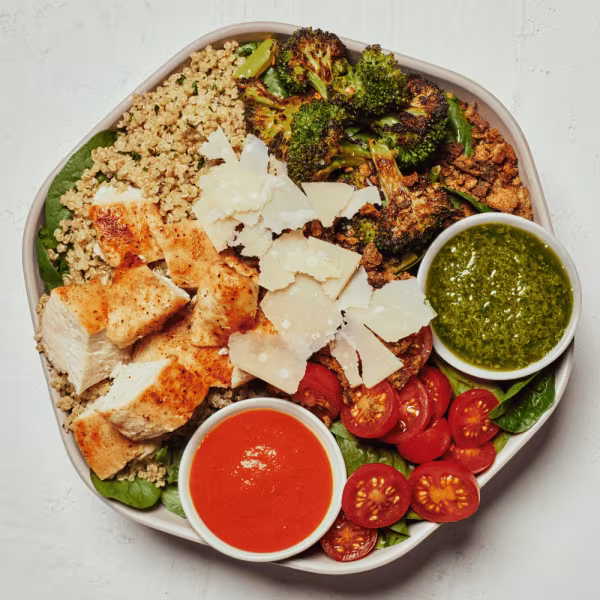

# Chicken Pesto Parm

### Official Summary:
- **Ingredients:** [Roasted Chicken](../Meats_Proteins/Roasted_Chicken.md), [Spicy Broccoli](../Cooked_Vegetables/Spicy_Broccoli.md), cherry tomatoes, shaved parmesan, za’atar breadcrumbs, [Herbed Quinoa](../Grains_Carbs/Herbed_Quinoa.md), baby spinach, sweetgreen hot sauce, [Pesto Vinaigrette](../Sauces_Dressings/Pesto_Vinaigrette.md)
- **Calories:** 540
- **Protein:** 39g
- **Carbs:** 40g
- **Fat:** 21g

### Estimated Ingredients and Macros:

| Ingredient                         | Amount                  | Calories | Protein | Carbs | Fat |
|------------------------------------|-------------------------|----------|---------|-------|-----|
| **[Roasted Chicken](../Meats_Proteins/Roasted_Chicken.md)**                | 6 oz (170g)             | ~250     | ~31g    | ~0g   | ~10g|
| **[Spicy Broccoli](../Cooked_Vegetables/Spicy_Broccoli.md)**                 | 1 cup (150g)            | ~50      | ~3g     | ~10g  | ~1g |
| **Cherry Tomatoes**                | 1 cup (150g)            | ~30      | ~1g     | ~6g   | ~0g |
| **Shaved Parmesan**                | 1/4 cup (28g)           | ~110     | ~10g    | ~1g   | ~8g |
| **Za’atar Breadcrumbs**            | 1/4 cup (30g)           | ~110     | ~3g     | ~15g  | ~2g |
| **[Herbed Quinoa](../Grains_Carbs/Herbed_Quinoa.md)**                  | 1/2 cup cooked (92g)    | ~111     | ~4g     | ~20g  | ~2g |
| **Baby Spinach**                   | 1 cup (30g)             | ~7       | ~1g     | ~1g   | ~0g |
| **Sweetgreen Hot Sauce**           | 1 tablespoon (15ml)     | ~30      | ~0g     | ~1g   | ~3g |
| **[Pesto Vinaigrette](../Sauces_Dressings/Pesto_Vinaigrette.md)**              | 2 tablespoons (30ml)    | ~150     | ~1g     | ~2g   | ~15g|

### Adjusted Total Macros:

- **Calories:** 848
- **Protein:** 55g
- **Carbs:** 56g
- **Fat:** 41g

[Back to Main Menu](../README.md)