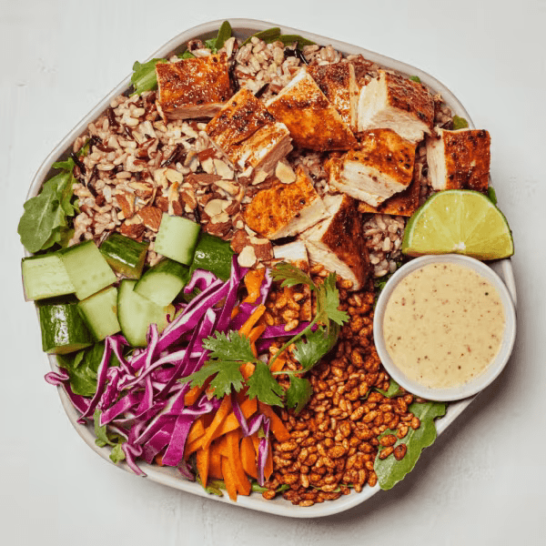

# Crispy Rice Bowl

### Official Summary:
- **Ingredients:** [Blackened Chicken](../Meats_Proteins/Blackened_Chicken.md), raw carrots, shredded cabbage, cucumbers, cilantro, roasted almonds, [Crispy Rice](../Grains_Carbs/Crispy_Rice.md), [Wild Rice](../Grains_Carbs/Wild_Rice.md), spring mix, lime squeeze, [Spicy Cashew](../Sauces_Dressings/Spicy_Cashew.md)
- **Calories:** 640
- **Protein:** 26g
- **Carbs:** 59g
- **Fat:** 30g

### Estimated Ingredients and Macros:

| Ingredient                         | Amount                  | Calories | Protein | Carbs | Fat |
|------------------------------------|-------------------------|----------|---------|-------|-----|
| **[Blackened Chicken](../Meats_Proteins/Blackened_Chicken.md)**              | 6 oz (170g)             | ~300     | ~33g    | ~0g   | ~15g|
| **Raw Carrots**                    | 1 cup (128g)            | ~52      | ~1g     | ~12g  | ~0g |
| **Shredded Cabbage**               | 1 cup (89g)             | ~22      | ~1g     | ~5g   | ~0g |
| **Cucumbers**                      | 1 cup (150g)            | ~16      | ~1g     | ~4g   | ~0g |
| **Cilantro**                       | 1/4 cup (4g)            | ~1       | ~0g     | ~0g   | ~0g |
| **Roasted Almonds**                | 1/4 cup (28g)           | ~170     | ~6g     | ~6g   | ~15g|
| **[Crispy Rice](../Grains_Carbs/Crispy_Rice.md)**                    | 1/2 cup (35g)           | ~130     | ~2g     | ~28g  | ~1g |
| **[Wild Rice](../Grains_Carbs/Wild_Rice.md)**                      | 1/2 cup cooked (92g)    | ~80      | ~3g     | ~16g  | ~0.5g|
| **Spring Mix**                     | 1 cup (30g)             | ~7       | ~1g     | ~1g   | ~0g |
| **Lime Squeeze**                   | 1 wedge (~6g)           | ~1       | ~0g     | ~0g   | ~0g |
| **[Spicy Cashew](../Sauces_Dressings/Spicy_Cashew.md) Sauce**             | 2 tablespoons (30ml)    | ~84      | ~1g     | ~20g  | ~6g |

### Adjusted Total Macros:

- **Calories:** 863
- **Protein:** 49g
- **Carbs:** 92g
- **Fat:** 37.5g

[Back to Main Menu](../README.md)