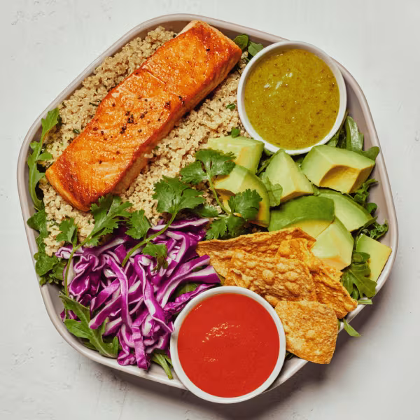

# Fish Taco

### Official Summary:
- **Ingredients:** [Miso Glazed Salmon](../Meats_Proteins/Miso_Glazed_Salmon.md), avocado, shredded cabbage, cilantro, tortilla chips, [Herbed Quinoa](../Grains_Carbs/Herbed_Quinoa.md), spring mix, sweetgreen hot sauce, [Lime Cilantro Jalapeño Vinaigrette](../Sauces_Dressings/Lime_Cilantro_Jalapeño_Vinaigrette.md)
- **Calories:** 835
- **Protein:** 34g
- **Carbs:** 60g
- **Fat:** 49g

### Estimated Ingredients and Macros:

| Ingredient                         | Amount                  | Calories | Protein | Carbs | Fat |
|------------------------------------|-------------------------|----------|---------|-------|-----|
| **[Miso Glazed Salmon](../Meats_Proteins/Miso_Glazed_Salmon.md)**             | 6 oz (170g)             | ~350     | ~34g    | ~0g   | ~20g|
| **Avocado**                        | 1/2 medium (100g)       | ~160     | ~2g     | ~9g   | ~15g|
| **Shredded Cabbage**               | 1 cup (89g)             | ~22      | ~1g     | ~5g   | ~0g |
| **Cilantro**                       | 1/4 cup (4g)            | ~1       | ~0g     | ~0g   | ~0g |
| **Tortilla Chips**                 | 1 oz (28g)              | ~140     | ~2g     | ~19g  | ~7g |
| **[Herbed Quinoa](../Grains_Carbs/Herbed_Quinoa.md)**                  | 1/2 cup cooked (92g)    | ~111     | ~4g     | ~20g  | ~2g |
| **Spring Mix**                     | 1 cup (30g)             | ~7       | ~1g     | ~1g   | ~0g |
| **Sweetgreen Hot Sauce**           | 1 tablespoon (15ml)     | ~30      | ~0g     | ~1g   | ~3g |
| **[Lime Cilantro Jalapeño Vinaigrette](../Sauces_Dressings/Lime_Cilantro_Jalapeño_Vinaigrette.md)** | 2 tablespoons (30ml) | ~14      | ~1g     | ~5g   | ~2g |

### Adjusted Total Macros:

- **Calories:** 835
- **Protein:** 45g
- **Carbs:** 60g
- **Fat:** 49g

[Back to Main Menu](../README.md)