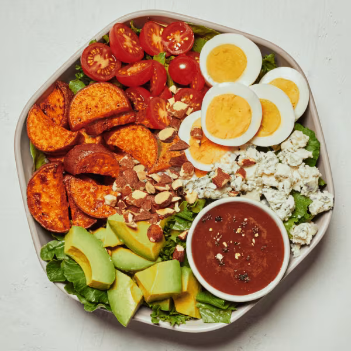

# Garden Cobb

### Official Summary:
- **Ingredients:** Avocado, hard boiled egg, roasted sweet potatoes, cherry tomatoes, blue cheese, roasted almonds, spring mix, chopped romaine, balsamic vinaigrette
- **Calories:** 745
- **Protein:** 22g
- **Carbs:** 36g
- **Fat:** 56g

### Estimated Ingredients and Macros:

| Ingredient                         | Amount                  | Calories | Protein | Carbs | Fat |
|------------------------------------|-------------------------|----------|---------|-------|-----|
| **Avocado**                        | 1/2 medium (100g)       | ~160     | ~2g     | ~9g   | ~15g|
| **Hard Boiled Egg**                | 1 large (50g)           | ~70      | ~6g     | ~1g   | ~5g |
| **Roasted Sweet Potatoes**         | 1 cup (133g)            | ~112     | ~2g     | ~27g  | ~0g |
| **Cherry Tomatoes**                | 1 cup (150g)            | ~30      | ~1g     | ~6g   | ~0g |
| **Blue Cheese**                    | 1/4 cup (28g)           | ~100     | ~6g     | ~1g   | ~8g |
| **Roasted Almonds**                | 1/4 cup (28g)           | ~170     | ~6g     | ~6g   | ~15g|
| **Spring Mix**                     | 1 cup (30g)             | ~7       | ~1g     | ~1g   | ~0g |
| **Chopped Romaine**                | 1 cup (47g)             | ~8       | ~1g     | ~2g   | ~0g |
| **Balsamic Vinaigrette**           | 2 tablespoons (30ml)    | ~70      | ~1g     | ~2g   | ~7g |

### Adjusted Total Macros:

- **Calories:** 727
- **Protein:** 26g
- **Carbs:** 55g
- **Fat:** 50g

[Back to Main Menu](../README.md)