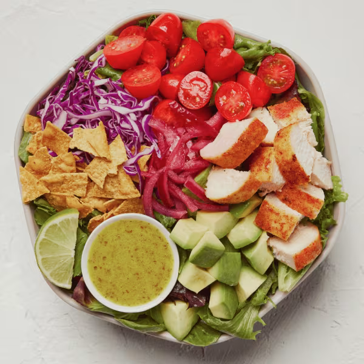

# Guacamole Greens

### Official Summary:
- **Ingredients:** [Roasted Chicken](../Meats_Proteins/Roasted_Chicken.md), avocado, cherry tomatoes, [Pickled Onions](../Fermented_Vegetables/Pickled_Onions.md), shredded cabbage, tortilla chips, spring mix, chopped romaine, lime squeeze, [Lime Cilantro Jalapeño Vinaigrette](../Sauces_Dressings/Lime_Cilantro_Jalapeño_Vinaigrette.md)
- **Calories:** 575
- **Protein:** 27g
- **Carbs:** 36g
- **Fat:** 33g

### Estimated Ingredients and Macros:

| Ingredient                         | Amount                  | Calories | Protein | Carbs | Fat |
|------------------------------------|-------------------------|----------|---------|-------|-----|
| **[Roasted Chicken](../Meats_Proteins/Roasted_Chicken.md)**                | 6 oz (170g)             | ~250     | ~31g    | ~0g   | ~10g|
| **Avocado**                        | 1/2 medium (100g)       | ~160     | ~2g     | ~9g   | ~15g|
| **Cherry Tomatoes**                | 1 cup (150g)            | ~30      | ~1g     | ~6g   | ~0g |
| **[Pickled Onions](../Fermented_Vegetables/Pickled_Onions.md)**                 | 1/4 cup (30g)           | ~10      | ~0g     | ~2g   | ~0g |
| **Shredded Cabbage**               | 1 cup (89g)             | ~22      | ~1g     | ~5g   | ~0g |
| **Tortilla Chips**                 | 1 oz (28g)              | ~140     | ~2g     | ~19g  | ~7g |
| **Spring Mix**                     | 1 cup (30g)             | ~7       | ~1g     | ~1g   | ~0g |
| **Chopped Romaine**                | 1 cup (47g)             | ~8       | ~1g     | ~2g   | ~0g |
| **Lime Squeeze**                   | 1 wedge (~6g)           | ~1       | ~0g     | ~0g   | ~0g |
| **[Lime Cilantro Jalapeño Vinaigrette](../Sauces_Dressings/Lime_Cilantro_Jalapeño_Vinaigrette.md)** | 2 tablespoons (30ml) | ~14      | ~1g     | ~5g   | ~2g |

### Adjusted Total Macros:

- **Calories:** 642
- **Protein:** 40g
- **Carbs:** 58g
- **Fat:** 34g

[Back to Main Menu](../README.md)