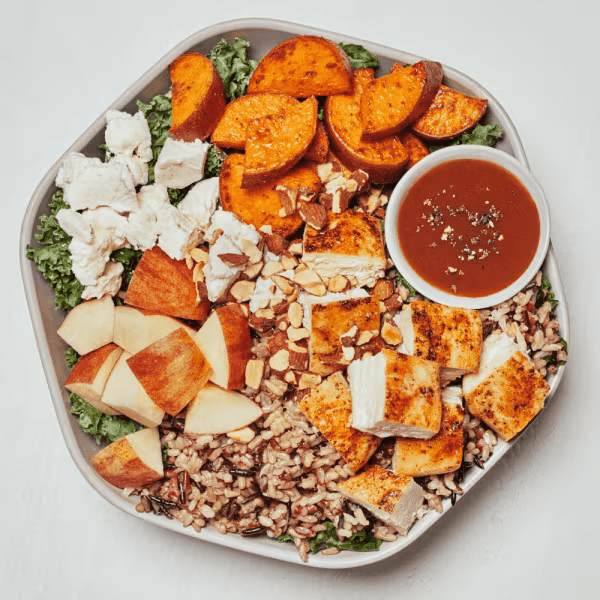

# Harvest Bowl

### Official Summary:
- **Ingredients:** [Roasted Chicken](../Meats_Proteins/Roasted_Chicken.md), roasted sweet potatoes, apples, goat cheese, roasted almonds, [Wild Rice](../Grains_Carbs/Wild_Rice.md), shredded kale, balsamic vinaigrette
- **Calories:** 765
- **Protein:** 38g
- **Carbs:** 63g
- **Fat:** 41g

### Estimated Ingredients and Macros:

| Ingredient                         | Amount                  | Calories | Protein | Carbs | Fat |
|------------------------------------|-------------------------|----------|---------|-------|-----|
| **[Roasted Chicken](../Meats_Proteins/Roasted_Chicken.md)**                | 6 oz (170g)             | ~250     | ~31g    | ~0g   | ~10g|
| **Roasted Sweet Potatoes**         | 1 cup (133g)            | ~112     | ~2g     | ~27g  | ~0g |
| **Apples**                         | 1 medium (182g)         | ~95      | ~0g     | ~25g  | ~0g |
| **Goat Cheese**                    | 1/4 cup (28g)           | ~102     | ~6g     | ~1g   | ~8g |
| **Roasted Almonds**                | 1/4 cup (28g)           | ~170     | ~6g     | ~6g   | ~15g|
| **[Wild Rice](../Grains_Carbs/Wild_Rice.md)**                      | 1/2 cup cooked (92g)    | ~160     | ~6g     | ~32g  | ~1g |
| **Shredded Kale**                  | 1 cup (67g)             | ~34      | ~2g     | ~7g   | ~0g |
| **Balsamic Vinaigrette**           | 2 tablespoons (30ml)    | ~70      | ~1g     | ~2g   | ~7g |

### Adjusted Total Macros:

- **Calories:** 793
- **Protein:** 54g
- **Carbs:** 100g
- **Fat:** 41g

[Back to Main Menu](../README.md)