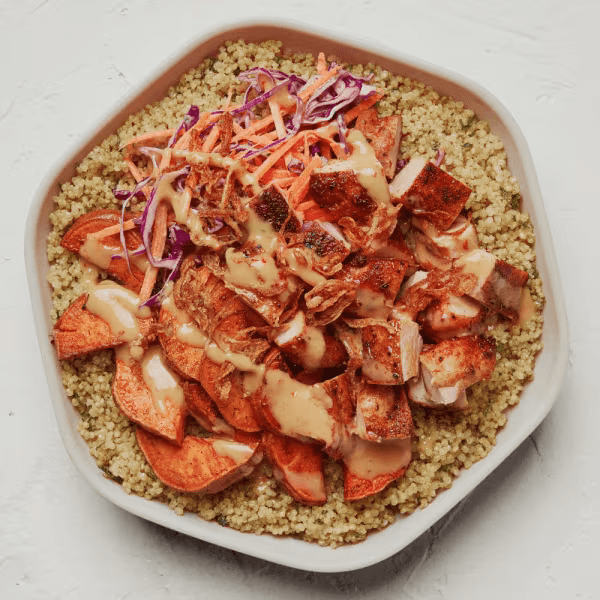

# Hot Honey Chicken

### Official Summary:
- **Ingredients:** [Blackened Chicken](../Meats_Proteins/Blackened_Chicken.md), [Warm Roasted Sweet Potatoes](../Cooked_Vegetables/Warm_Roasted_Sweet_Potatoes.md), veg slaw, [Crispy Onions](../Cooked_Vegetables/Crispy_Onions.md), [Herbed Quinoa](../Grains_Carbs/Herbed_Quinoa.md), [Hot Honey Mustard Sauce](../Sauces_Dressings/Hot_Honey_Mustard_Sauce.md)
- **Calories:** 835
- **Protein:** 43g
- **Carbs:** 75g
- **Fat:** 39g

### Estimated Ingredients and Macros:

| Ingredient                         | Amount                  | Calories | Protein | Carbs | Fat |
|------------------------------------|-------------------------|----------|---------|-------|-----|
| **[Blackened Chicken](../Meats_Proteins/Blackened_Chicken.md)**              | 6 oz (170g)             | ~300     | ~33g    | ~0g   | ~15g|
| **[Warm Roasted Sweet Potatoes](../Cooked_Vegetables/Warm_Roasted_Sweet_Potatoes.md)**    | 1 cup (133g)            | ~112     | ~2g     | ~27g  | ~0g |
| **Veg Slaw**                       | 1 cup (100g)            | ~50      | ~2g     | ~12g  | ~1g |
| **[Crispy Onions](../Cooked_Vegetables/Crispy_Onions.md)**                  | 1/4 cup (15g)           | ~70      | ~1g     | ~5g   | ~5g |
| **[Herbed Quinoa](../Grains_Carbs/Herbed_Quinoa.md)**                  | 1/2 cup cooked (92g)    | ~111     | ~4g     | ~20g  | ~2g |
| **[Hot Honey Mustard Sauce](../Sauces_Dressings/Hot_Honey_Mustard_Sauce.md)**        | 2 tablespoons (30ml)    | ~192     | ~1g     | ~11g  | ~16g|

### Adjusted Total Macros:

- **Calories:** 835
- **Protein:** 43g
- **Carbs:** 75g
- **Fat:** 39g

[Back to Main Menu](../README.md)