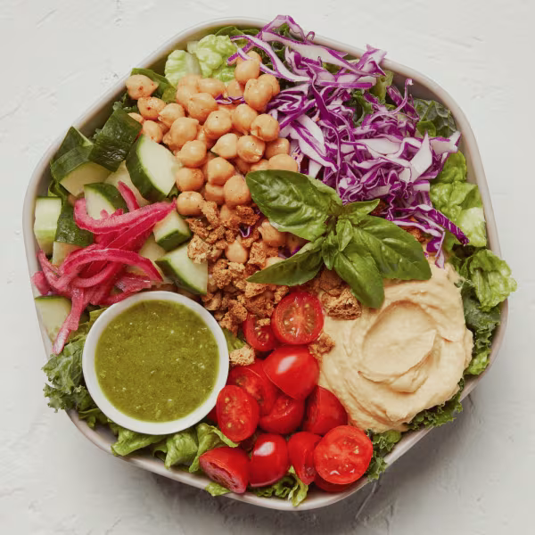

# Hummus Crunch

### Official Summary:
- **Ingredients:** Hummus, chickpeas, cherry tomatoes, cucumbers, shredded cabbage, [Pickled Onions](../Fermented_Vegetables/Pickled_Onions.md), basil, za’atar breadcrumbs, chopped romaine, shredded kale, [Pesto Vinaigrette](../Sauces_Dressings/Pesto_Vinaigrette.md)
- **Calories:** 405
- **Protein:**

 14g
- **Carbs:** 42g
- **Fat:** 19g

### Estimated Ingredients and Macros:

| Ingredient                         | Amount                  | Calories | Protein | Carbs | Fat |
|------------------------------------|-------------------------|----------|---------|-------|-----|
| **Hummus**                         | 1/4 cup (60g)           | ~140     | ~6g     | ~12g  | ~8g |
| **Chickpeas**                      | 1/2 cup (82g)           | ~120     | ~6g     | ~20g  | ~2g |
| **Cherry Tomatoes**                | 1 cup (150g)            | ~30      | ~1g     | ~6g   | ~0g |
| **Cucumbers**                      | 1 cup (150g)            | ~16      | ~1g     | ~4g   | ~0g |
| **Shredded Cabbage**               | 1 cup (89g)             | ~22      | ~1g     | ~5g   | ~0g |
| **[Pickled Onions](../Fermented_Vegetables/Pickled_Onions.md)**                 | 1/4 cup (30g)           | ~10      | ~0g     | ~2g   | ~0g |
| **Basil**                          | 1/4 cup (10g)           | ~1       | ~0g     | ~0g   | ~0g |
| **Za’atar Breadcrumbs**            | 1/4 cup (30g)           | ~110     | ~3g     | ~15g  | ~2g |
| **Chopped Romaine**                | 1 cup (47g)             | ~8       | ~1g     | ~2g   | ~0g |
| **Shredded Kale**                  | 1 cup (67g)             | ~34      | ~2g     | ~7g   | ~0g |
| **[Pesto Vinaigrette](../Sauces_Dressings/Pesto_Vinaigrette.md)**              | 2 tablespoons (30ml)    | ~150     | ~1g     | ~2g   | ~15g|

### Adjusted Total Macros:

- **Calories:** 641
- **Protein:** 22g
- **Carbs:** 75g
- **Fat:** 27g

[Back to Main Menu](../README.md)