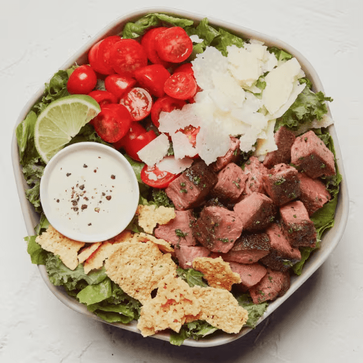

# Kale Caesar (Steak)

### Official Summary:
- **Ingredients:** [Caramelized Garlic Steak](../Meats_Proteins/Caramelized_Garlic_Steak.md), cherry tomatoes, parmesan crisps, shaved parmesan, chopped romaine, shredded kale, caesar, lime squeeze
- **Calories:** 720
- **Protein:** 39g
- **Carbs:** 21g
- **Fat:** 54g

### Estimated Ingredients and Macros:

| Ingredient                         | Amount                  | Calories | Protein | Carbs | Fat |
|------------------------------------|-------------------------|----------|---------|-------|-----|
| **[Caramelized Garlic Steak](../Meats_Proteins/Caramelized_Garlic_Steak.md)**       | 6 oz (170g)             | ~300     | ~25g    | ~0g   | ~15g|
| **Cherry Tomatoes**                | 1 cup (150g)            | ~30      | ~1g     | ~6g   | ~0g |
| **Parmesan Crisps**                | 1/4 cup (25g)           | ~130     | ~10g    | ~1g   | ~9g |
| **Shaved Parmesan**                | 1/4 cup (28g)           | ~110     | ~10g    | ~1g   | ~8g |
| **Chopped Romaine**                | 1 cup (47g)             | ~8       | ~1g     | ~2g   | ~0g |
| **Shredded Kale**                  | 1 cup (67g)             | ~34      | ~2g     | ~7g   | ~0g |
| **[Caesar Dressing](../Sauces_Dressings/Caesar_Dressing.md)**                | 2 tablespoons (30ml)    | ~150     | ~2g     | ~2g   | ~16g |
| **Lime Squeeze**                   | 1 wedge (~6g)           | ~1       | ~0g     | ~0g   | ~0g |

### Adjusted Total Macros:

- **Calories:** 763
- **Protein:** 51g
- **Carbs:** 19g
- **Fat:** 48g

[Back to Main Menu](../README.md)