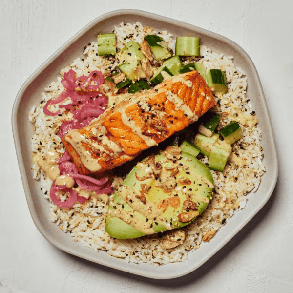

# Miso Glazed Salmon

### Official Summary:
- **Ingredients:** [Miso Glazed Salmon](../Meats_Proteins/Miso_Glazed_Salmon.md), avocado, cucumbers, [Pickled Onions](../Fermented_Vegetables/Pickled_Onions.md), [Crispy Onions](../Cooked_Vegetables/Crispy_Onions.md), [White Rice](../Grains_Carbs/White_Rice.md), nori sesame seasoning, [Spicy Cashew](../Sauces_Dressings/Spicy_Cashew.md)
- **Calories:** 930
- **Protein:** 35g
- **Carbs:** 88g
- **Fat:** 48g

### Estimated Ingredients and Macros:

| Ingredient                         | Amount                  | Calories | Protein | Carbs | Fat |
|------------------------------------|-------------------------|----------|---------|-------|-----|
| **[Miso Glazed Salmon](../Meats_Proteins/Miso_Glazed_Salmon.md)**             | 6 oz (170g)             | ~350     | ~34g    | ~0g   | ~20g|
| **Avocado**                        | 1/2 medium (100g)       | ~160     | ~2g     | ~9g   | ~15g|
| **Cucumbers**                      | 1 cup (150g)            | ~16      | ~1g     | ~4g   | ~0g |
| **[Pickled Onions](../Fermented_Vegetables/Pickled_Onions.md)**                 | 1/4 cup (30g)           | ~10      | ~0g     | ~2g   | ~0g |
| **[Crispy Onions](../Cooked_Vegetables/Crispy_Onions.md)**                  | 1/4 cup (15g)           | ~70      | ~1g     | ~5g   | ~5g |
| **[White Rice](../Grains_Carbs/White_Rice.md)**                     | 1 cup cooked (185g)     | ~205     | ~4g     | ~45g  | ~0g |
| **Nori Sesame Seasoning**          | 1 tablespoon (6g)       | ~35      | ~2g     | ~3g   | ~2g |
| **[Spicy Cashew](../Sauces_Dressings/Spicy_Cashew.md) Sauce**             | 2 tablespoons (30ml)    | ~84      | ~1g     | ~20g  | ~6g |

### Adjusted Total Macros:

- **Calories:** 930
- **Protein:** 45g
- **Carbs:** 88g
- **Fat:** 48g

[Back to Main Menu](../README.md)