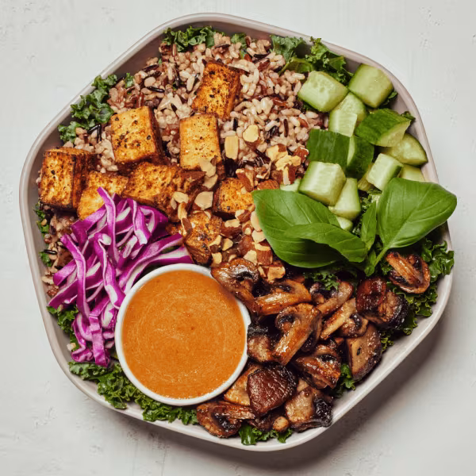

# Shroomami

### Official Summary:
- **Ingredients:** [Roasted Tofu](../Meats_Proteins/Roasted_Tofu.md), [Roasted Portobello Mix](../Cooked_Vegetables/Roasted_Portobello_Mix.md), cucumbers, basil, shredded cabbage, roasted almonds, [Wild Rice](../Grains_Carbs/Wild_Rice.md), shredded kale, miso sesame ginger dressing
- **Calories:** 685
- **Protein:** 22g
- **Carbs:** 53g
- **Fat:** 44g

### Estimated Ingredients and Macros:

| Ingredient                         | Amount                  | Calories | Protein | Carbs | Fat |
|------------------------------------|-------------------------|----------|---------|-------|-----|
| **[Roasted Tofu](../Meats_Proteins/Roasted_Tofu.md)**                   | 6 oz (170g)             | ~180     | ~15g    | ~4g   | ~12g|
| **[Roasted Portobello Mix](../Cooked_Vegetables/Roasted_Portobello_Mix.md)**            | 1 cup (156g)            | ~30      | ~3g     | ~5g   | ~0g |
| **Cucumbers**                      | 1 cup (150g)            | ~16      | ~1g     | ~4g   | ~0g |
| **Basil**                          | 1/4 cup (10g)           | ~1       | ~0g     | ~0g   | ~0g |
| **Shredded Cabbage**               | 1 cup (89g)             | ~22      | ~1g     | ~5g   | ~0g |
| **Roasted Almonds**                | 1/4 cup (28g)           | ~170     | ~6g     | ~6g   | ~15g|
| **[Wild Rice](../Grains_Carbs/Wild_Rice.md)**                      | 1/2 cup cooked (92g)    | ~80      | ~3g     | ~16g  | ~0.5g|
| **Shredded Kale**                  | 1 cup (67g)             | ~34      | ~2g     | ~7g   | ~0g |
| **Miso Sesame Ginger Dressing**    | 2 tablespoons (30ml)    | ~152     | ~2g     | ~6g   | ~12g|

### Adjusted Total Macros:

- **Calories:** 685
- **Protein:** 33g
- **Carbs:** 53g
- **Fat:** 39.5g

[Back to Main Menu](../README.md)