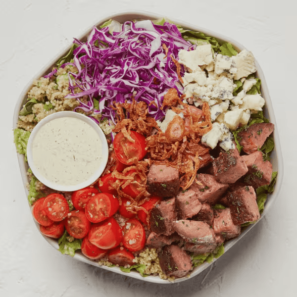

# Steakhouse Chopped

### Official Summary:
- **Ingredients:** [Caramelized Garlic Steak](../Meats_Proteins/Caramelized_Garlic_Steak.md), shredded cabbage, cherry tomatoes, [Crispy Onions](../Cooked_Vegetables/Crispy_Onions.md), blue cheese, [Herbed Quinoa](../Grains_Carbs/Herbed_Quinoa.md), chopped romaine, [Green Goddess Ranch](../Sauces_Dressings/Green_Goddess_Ranch.md)
- **Calories:** 815
- **Protein:** 35g
- **Carbs:** 40g
- **Fat:** 57g

### Estimated Ingredients and Macros:

| Ingredient                         | Amount                  | Calories | Protein | Carbs | Fat |
|------------------------------------|-------------------------|----------|---------|-------|-----|
| **[Caramelized Garlic Steak](../Meats_Proteins/Caramelized_Garlic_Steak.md)**       | 6 oz (170g)             | ~300     | ~25g    | ~0g   | ~15g|
| **Shredded Cabbage**               | 1 cup (89g)             | ~22      | ~1g     | ~5g   | ~0g |
| **Cherry Tomatoes**                | 1 cup (150g)            | ~30      | ~1g     | ~6g   | ~0g |
| **[Crispy Onions](../Cooked_Vegetables/Crispy_Onions.md)**                  | 1/4 cup (15g)           | ~70      | ~1g     | ~5g   | ~5g |
| **Blue Cheese**                    | 1/4 cup (28g)           | ~100     | ~6g     | ~1g   | ~8g |
| **[Herbed Quinoa](../Grains_Carbs/Herbed_Quinoa.md)**                  | 1/2 cup cooked (92g)    | ~111     | ~4g     | ~20g  | ~2g |
| **Chopped Romaine**                | 1 cup (47g)             | ~8       | ~1g     | ~2g   | ~0g |
| **[Green Goddess Ranch](../Sauces_Dressings/Green_Goddess_Ranch.md)**            | 2 tablespoons (30ml)    | ~120     | ~2g     | ~1g   | ~12g|

### Adjusted Total Macros:

- **Calories:** 761
- **Protein:** 41g
- **Carbs:** 40g
- **Fat:** 42g

[Back to Main Menu](../README.md)