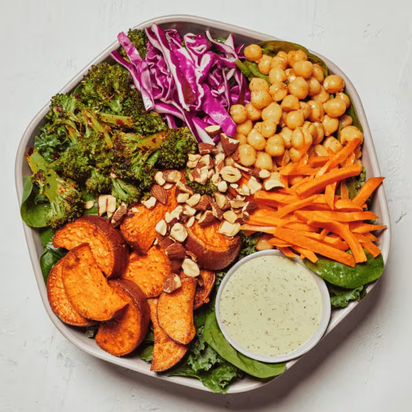

# Super Green Goddess

### Official Summary:
- **Ingredients:** Chickpeas, roasted sweet potatoes, raw carrots, [Spicy Broccoli](../Cooked_Vegetables/Spicy_Broccoli.md), shredded cabbage, roasted almonds, baby spinach, shredded kale, [Green Goddess Ranch](../Sauces_Dressings/Green_Goddess_Ranch.md)
- **Calories:** 455
- **Protein:** 12g
- **Carbs:** 39g
- **Fat:** 29g

### Estimated Ingredients and Macros:

| Ingredient                         | Amount                  | Calories | Protein | Carbs | Fat |
|------------------------------------|-------------------------|----------|---------|-------|-----|
| **Chickpeas**                      | 1/2 cup (82g)           | ~120     | ~6g     | ~20g  | ~2g |
| **Roasted Sweet Potatoes**         | 1 cup (133g)            | ~112     | ~2g     | ~27g  | ~0g |
| **Raw Carrots**                    | 1 cup (128g)            | ~52      | ~1g     | ~12g  | ~0g |
| **[Spicy Broccoli](../Cooked_Vegetables/Spicy_Broccoli.md)**                 | 1 cup (150g)            | ~50      | ~3g     | ~10g  | ~1g |
| **Shredded Cabbage**               | 1 cup (89g)             | ~22      | ~1g     | ~5g   | ~0g |
| **Roasted Almonds**                | 1/4 cup (28g)           | ~170     | ~6g     | ~6g   | ~15g|
| **Baby Spinach**                   | 1 cup (30g)             | ~7       | ~1g     | ~1g   | ~0g |
| **Shredded Kale**                  | 1 cup (67g)             | ~34      | ~2g     | ~7g   | ~0g |
| **[Green Goddess Ranch](../Sauces_Dressings/Green_Goddess_Ranch.md)**            | 2 tablespoons (30ml)    | ~120     | ~2g     | ~1g   | ~12g|

### Adjusted Total Macros:

- **Calories:** 687
- **Protein:** 24g
- **Carbs:** 89g
- **Fat:** 30g

[Back to Main Menu](../README.md)